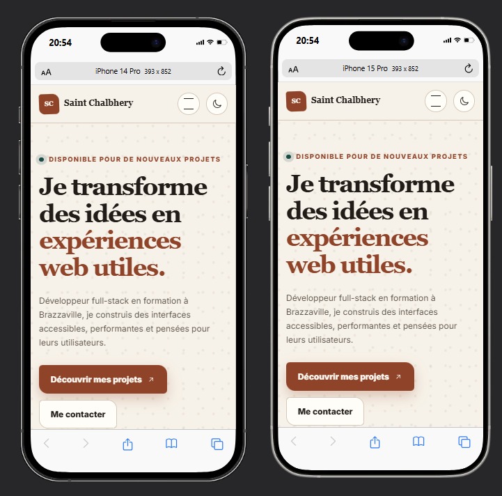

<div align="center">

# Portfolio — MALONGA Saint Chalbhery

**Portfolio personnel responsive en HTML et CSS présentant mes projets, compétences et parcours**

[](https://developer.mozilla.org/fr/docs/Web/HTML)
[](https://developer.mozilla.org/fr/docs/Web/CSS)
[](https://akieni.com)
[](https://validator.w3.org/)

</div>

---

## À propos

Portfolio personnel de **MALONGA Saint Chalbhery**, développeur web full-stack en formation à l’Akieni Academy et basé à Brazzaville.

Le site présente mon profil, mes compétences techniques, six projets récents, mon parcours de formation et les différents moyens de me contacter dans une identité visuelle personnelle.

> HTML5 · CSS3 · Flexbox · Grid · media queries 600px, 768px et 1024px · menu, thème sombre et filtres en CSS pur

## Aperçu


### Mobile



## Fonctionnalités

- Hero avec portrait, titre, sous-titre et appels à l’action
- Présentation personnelle et valeurs
- Compétences accompagnées de pourcentages
- Galerie de six projets avec captures réelles
- Description détaillée affichée au survol ou au focus
- Filtres par technologie réalisés uniquement en CSS
- Timeline du parcours et de la formation
- Formulaire de contact avec ouverture du logiciel de messagerie
- Footer avec coordonnées et réseaux sociaux
- Menu burger mobile réalisé uniquement en CSS
- Mode sombre réalisé uniquement en CSS
- Mise en page mobile-first pour téléphone, tablette et ordinateur
- Respect de la préférence de réduction des animations

## Sections

| Section | Contenu |
|---|---|
| Accueil | Portrait, présentation, statistiques et appels à l’action |
| À propos | Parcours personnel, objectifs et valeurs |
| Compétences | Niveaux en front-end, back-end et outils |
| Projets | Six réalisations, technologies et liens GitHub |
| Expérience | Formation présentée sous forme de timeline |
| Contact | Coordonnées et formulaire |
| Footer | GitHub, LinkedIn et e-mail |

## Projets présentés

| Projet | Technologies | Dépôt |
|---|---|---|
| Landing page LearnThis | HTML, CSS, responsive | [Voir le dépôt](https://github.com/Chal-B/landing_page) |
| Navigation responsive | HTML, CSS, mobile-first | [Voir le dépôt](https://github.com/Chal-B/navigation_responsive) |
| Dashboard admin | CSS Grid, Flexbox | [Voir le dépôt](https://github.com/Chal-B/dashboard_admin) |
| Galerie du Congo | CSS Grid, lightbox | [Voir le dépôt](https://github.com/Chal-B/galerie_de_photos) |
| Mana Restaurant | HTML, CSS, responsive | [Voir le dépôt](https://github.com/Chal-B/mana_restaurant) |
| Carte produit Shopline | HTML, CSS, composant | [Voir le dépôt](https://github.com/Chal-B/carte_produit_stylisee) |

## Installation

Télécharger ou cloner le dépôt, puis ouvrir le dossier du projet :

```bash
git clone https://github.com/Chal-B/profil_personnel_stylise.git
cd profil_personnel_stylise
```

Ouvrir ensuite `index.html` dans le navigateur. L’utilisation de **Live Server** est optionnelle.

## Utilisation

| Écran | Comportement |
|---|---|
| Ordinateur (≥ 1024px) | Navigation horizontale et galerie sur trois colonnes |
| Tablette (≥ 768px) | Sections en deux colonnes et navigation horizontale |
| Grand mobile (≥ 600px) | Galerie sur deux colonnes |
| Mobile (< 600px) | Menu burger et contenu sur une colonne |

## Structure

```text
profil_personnel_stylise/
├── index.html
├── style.css
├── images/
│   ├── photo-profil.jpeg
│   └── projects/
│       ├── landing-page.png
│       ├── navigation.png
│       ├── dashboard.png
│       ├── galerie-congo.png
│       ├── mana-restaurant.png
│       └── carte-produit.png
├── preview.png
├── preview-mobile.png
└── README.md
```

## Technologies

| Technologie | Utilisation |
|---|---|
| HTML5 | Structure sémantique des sept sections |
| CSS3 | Mise en forme, animations et responsive |
| Flexbox | Navigation, boutons, filtres et alignements |
| CSS Grid | Hero, compétences, projets, expérience et contact |
| Variables CSS | Palette, typographies, ombres et dimensions |
| Sélecteurs CSS | Menu mobile, thème sombre et filtrage des projets |
| Google Fonts | Space Grotesk et Manrope |
| Git | Historique du projet avec au moins 20 commits |

## Formulaire

Le formulaire de contact utilise une action `mailto:`. Il ouvre le logiciel de messagerie configuré sur l’appareil, mais ne transmet pas directement les messages à un serveur.

## Accessibilité et performance

- HTML sémantique et hiérarchie de titres cohérente
- Lien d’évitement et navigation complète au clavier
- Focus visible sur les liens, contrôles et filtres
- Pourcentages de compétences disponibles sous forme de texte
- Dimensions des images définies et chargement différé des captures
- Animations désactivées avec `prefers-reduced-motion`
- Prise en charge des couleurs forcées

## Déploiement

Le projet est prévu pour être publié avec **GitHub Pages** :

[https://chal-b.github.io/profil_personnel_stylise/](https://chal-b.github.io/profil_personnel_stylise/)

## Contact

**MALONGA Saint Chalbhery** — [GitHub @Chal-B](https://github.com/Chal-B) — [LinkedIn](https://www.linkedin.com/in/saint-chalbhery-malonga-2784253b2) — saintmlg@icloud.com
