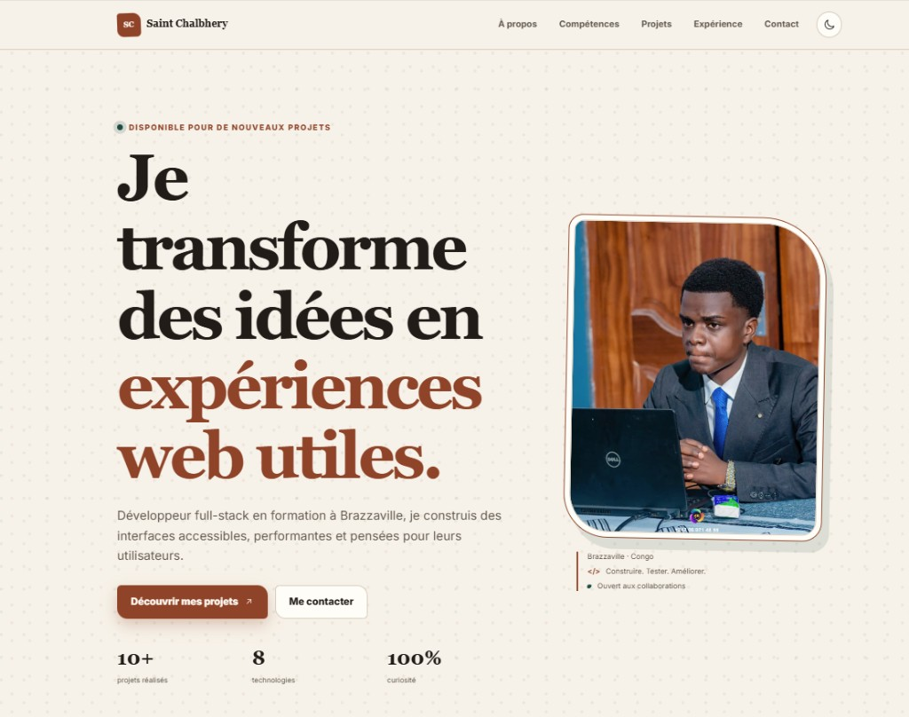

<div align="center">

# 👤 Profil Stylisé

**Page de profil développeur full-stack avec mise en page CSS en grille, cartes thématiques et design responsive**

[](https://developer.mozilla.org/fr/docs/Web/HTML)
[](https://developer.mozilla.org/fr/docs/Web/CSS)
[](https://akieni.com)
[](https://validator.w3.org/)

[Aperçu ](#-Aperçu ) · [Installation](#-installation) · [Architecture](#-architecture-du-projet) · [Contribuer](#-contribuer) · [Contact](#-contact)

</div>

---

## 📖 Table des matières

- [À propos](#-à-propos)
- [Fonctionnalités](#-fonctionnalités)
- [Aperçu ](#-Aperçu )
- [Prérequis](#-prérequis)
- [Installation](#-installation)
- [Utilisation](#-utilisation)
- [Architecture du projet](#-architecture-du-projet)
- [Technologies utilisées](#-technologies-utilisées)
- [Tests](#-tests)
- [Contribuer](#-contribuer)
- [Contact](#-contact)

---

##  À propos

Portfolio personnel stylisé en **HTML5 + CSS3**. La page présente identité, compétences techniques, parcours et formulaire de contact dans une interface en deux colonnes avec **8 cartes** thématiques.

> 💡 Séparation stricte contenu / présentation : HTML sémantique + feuille de style externe.

##  Fonctionnalités

- ✅ **Grille responsive** — sidebar + zone principale
- ✅ **8 cartes CSS** — profil, réseaux, infos, compétences, formation, contact
- ✅ **Variables CSS** — palette, espacements multiples de 8 px
- ✅ **Icônes SVG** — compétences et liens sociaux
- ✅ **Formulaire accessible** — labels associés, navigation par ancres

##  Aperçu 



🔗 **Fichier à ouvrir** : `index.html`

##  Prérequis

- Navigateur web moderne
- *(Optionnel)* [Live Server](https://marketplace.visualstudio.com/items?itemName=ritwickdey.LiveServer)

##  Installation

```bash
git clone https://github.com/Chal-B/profil_personnel_stylise.git
cd profil_personnel_stylise
```

Ouvrir **`index.html`** dans le navigateur.

##  Utilisation

Projet statique — ouvrir `index.html` et naviguer via le menu (Profil, À propos, Compétences, Formation, Réseaux, Contact).

##  Architecture du projet

```
profil_personnel_stylise/
├── index.html
├── style.css
├── images/
│   └── photo-profil.jpeg
├── icones/             # SVG GitHub, LinkedIn, HTML, CSS, JS…
├── preview.png
└── README.md
```

## Technologies utilisées

| Catégorie | Technologie |
|---|---|
| Structure | HTML5 sémantique |
| Styles | CSS3 — variables, grid, flexbox, reset box model |
| Typographie | Roboto + Open Sans (Google Fonts) |
| Couleur accent | `#2563eb` |
| Validation | W3C HTML + CSS |

##  Tests

- [Validateur HTML W3C](https://validator.w3.org/#validate_by_input)
- [Validateur CSS W3C](https://jigsaw.w3.org/css-validator/)

## 📬 Contact

**MALONGA Saint Chalbhery** — [GitHub @Chal-B](https://github.com/Chal-B) — [LinkedIn](https://www.linkedin.com/in/saint-chalbhery-malonga-2784253b2) — saintmlg@icloud.com

Lien du projet : [https://github.com/Chal-B/profil_personnel_stylise](https://github.com/Chal-B/profil_personnel_stylise)

---
